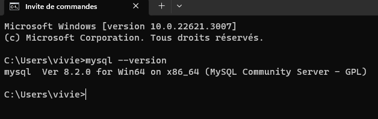
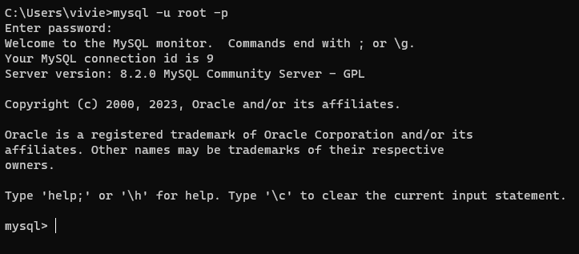
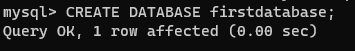

<h1 align="center">
  Les bases de données Sql 
</h1>

## Definition: 

SQL (sigle pour Structured Query Language, « langage de requêtes structurées ») est un langage informatique normalisé servant à exploiter des bases de données relationnelles. La partie langage de manipulation des données de SQL permet de rechercher, d'ajouter, de modifier ou de supprimer des données dans les bases de données relationnelles.

On utilise un SGBD (systeme de gestion de base de données ) pour manipuler des bases des données.

## Le SGBD

Le systeme de gestion de bases de données pour SQL s'appelle mysql. Pour connaitre notre version de mysql il faut ecrire le code suivant dans un CMD :
```
mysql --version
```
Nous obtenons ce resultat :


Pour utiliser mysql dans notre CMD il faudrait ecrire le code suivant : 

```
mysql -u root -p
```
Nous obtenons ce resultat :


Pour crée une nouvelle base de données il suffit d'ecrire le code suivant : 
```
CREATE DATABASE firstdatabase;
```
Nous obtenons ce resultat : 


